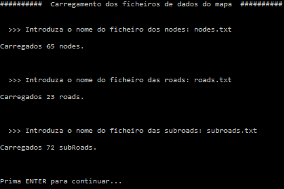
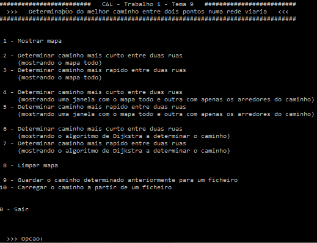
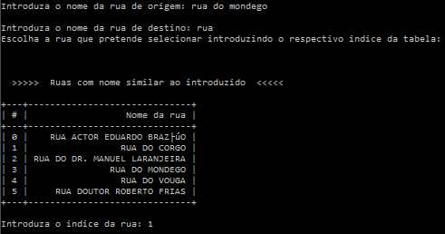

Shortest-Path-Finder-OSM
==================

Implementation of a system capable of finding the shortest path between two locations in OpenStreetMaps using Dijkstra's algorithm

Figure 1: Map setup

Figure 2: Main menu

Figure 3: Street search

")

Figure 4: Roadmap graph (cyan -> start of path, yellow -> path nodes, blue -> end of path)
